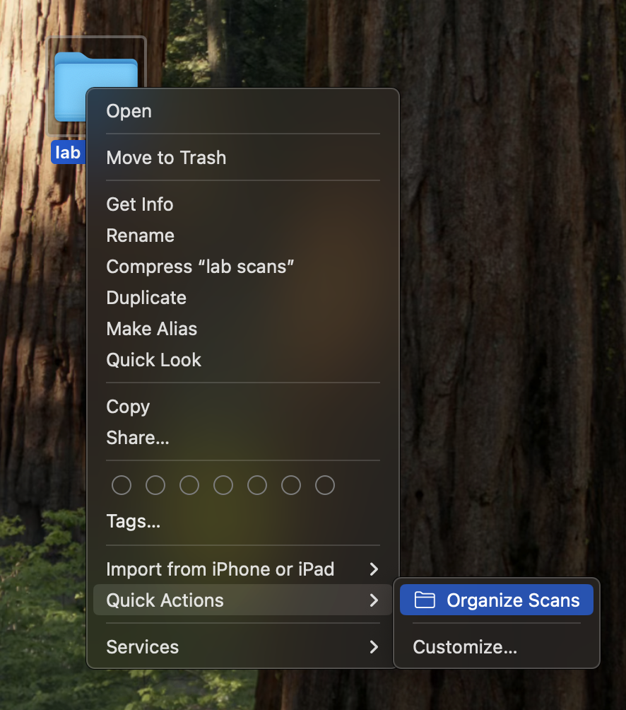
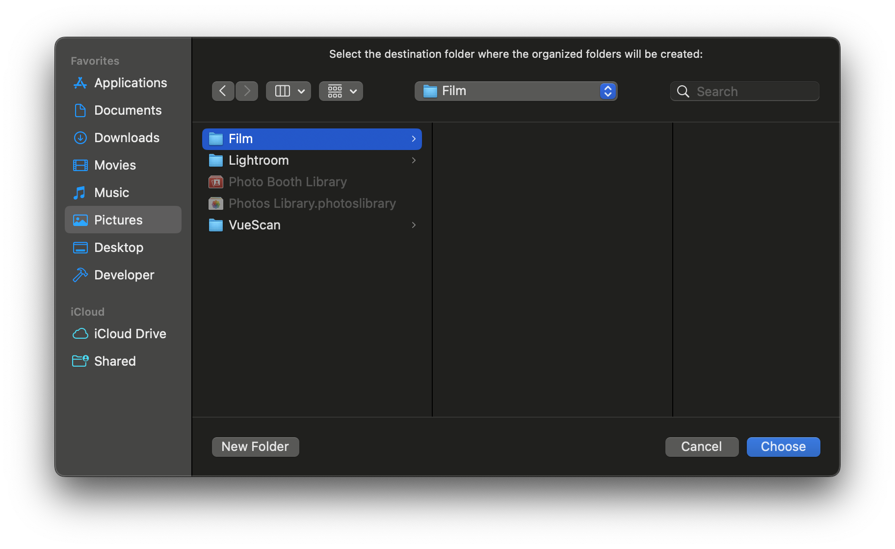
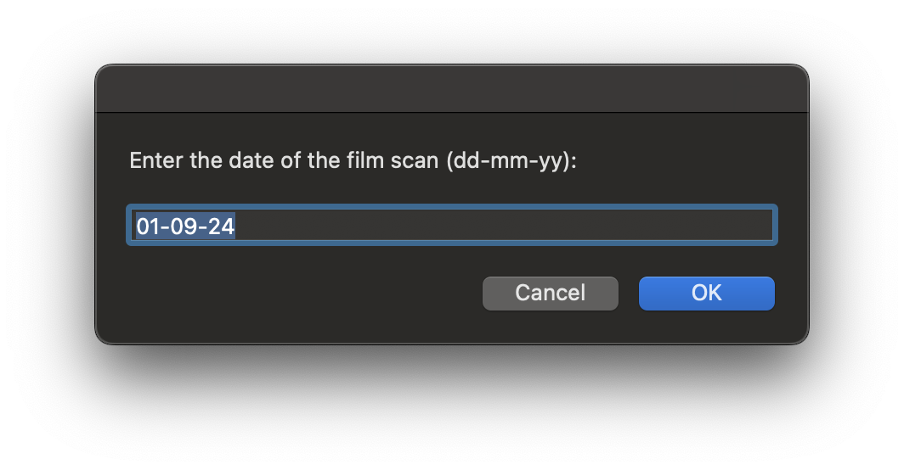
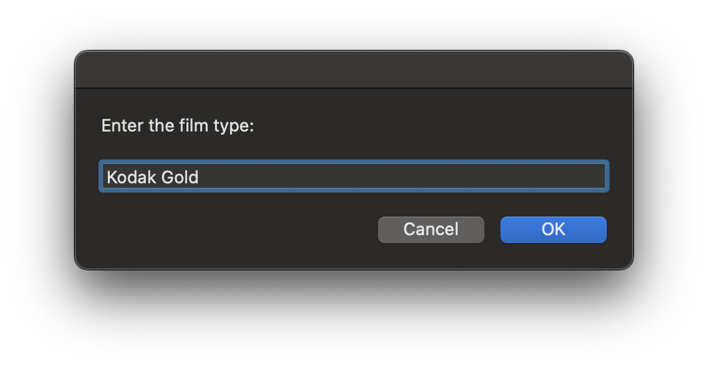
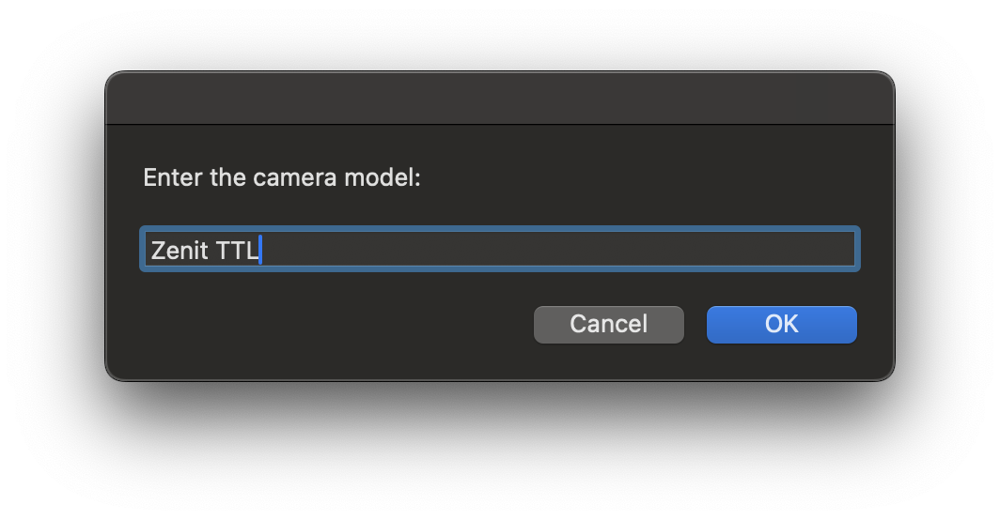
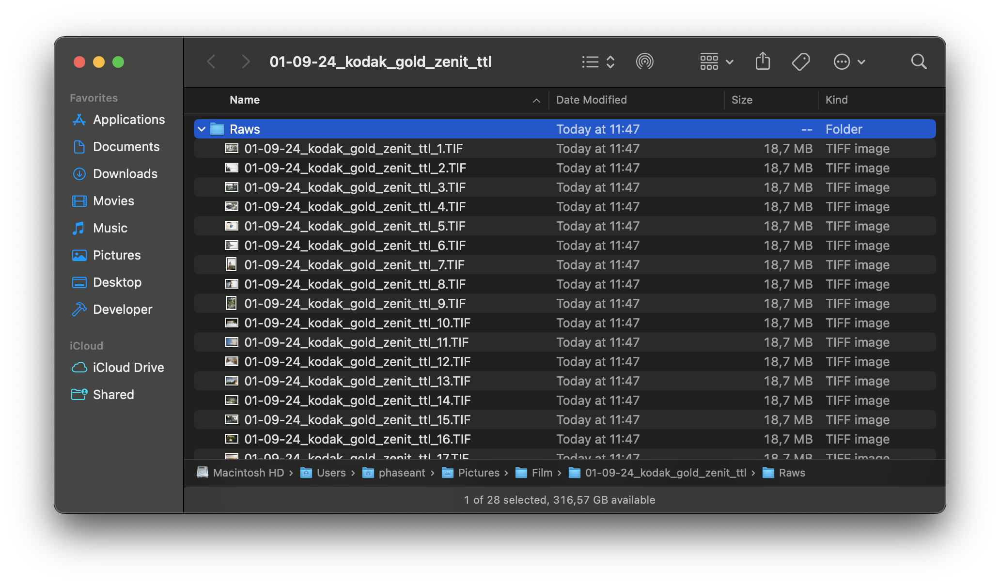

# Usage

1. Select Organize Scans quick action in context menu

2. Choose destination folder

3. Enter date of film scan (default is today's date)

4. Enter film type `Note: it will be formatted later`

5. Enter camera model `Note: it will be formatted later`

6. After organizing, destination folder will be opened

